# Quanlysanbong
<a name="top"><a>
## Mục lục

[Mô tả project](#project)\
&nbsp;&nbsp;&nbsp; [Công nghệ sử dụng](#use)\
&nbsp;&nbsp;&nbsp; [Tính năng chính](#main-feature)\
&nbsp;&nbsp;&nbsp; [Danh sách các màn hình](#screen)\
&nbsp;&nbsp;&nbsp; [Cài đặt](#setting)

## Mô tả Project 

### Công nghệ sử dụng 

- C#, WPF, SQL Server

[Lên đầu trang](#top)
### Tính năng chính 
- Đăng nhập, đăng ký (admin, nhân viên)
- Thống kê doanh thu
- Đặt sân bóng
- Thêm, xóa, sửa sân bóng, hàng hóa, nhân viên
- Quản lý nhập hàng hóa và in hóa đơn
- Thiết lập và tính lương cho nhân viên
[Lên đầu trang](#top)

### Danh sách các màn hình 

  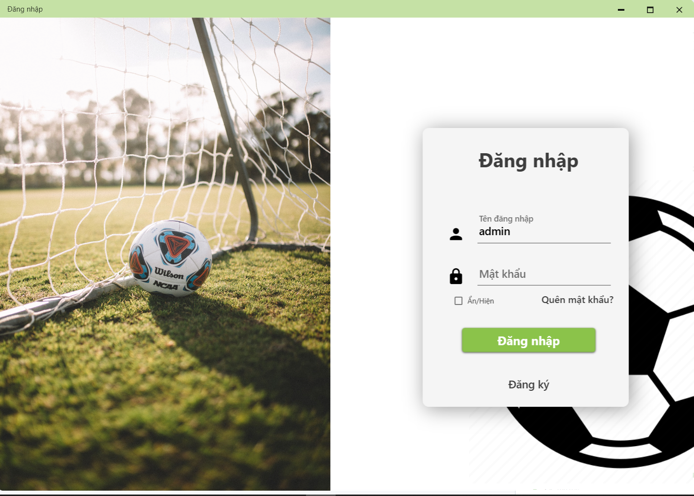
  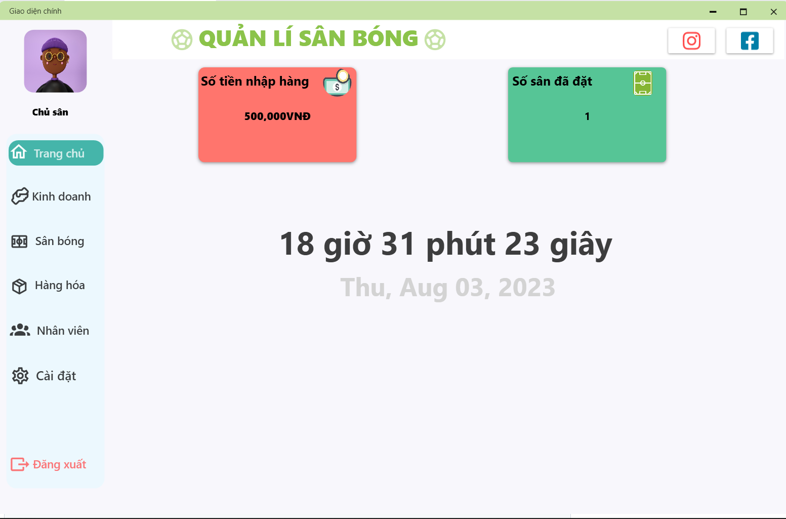
  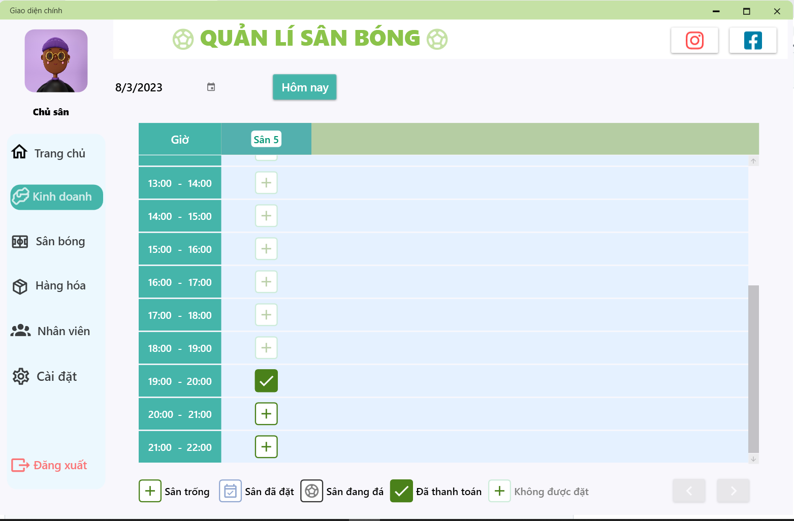
  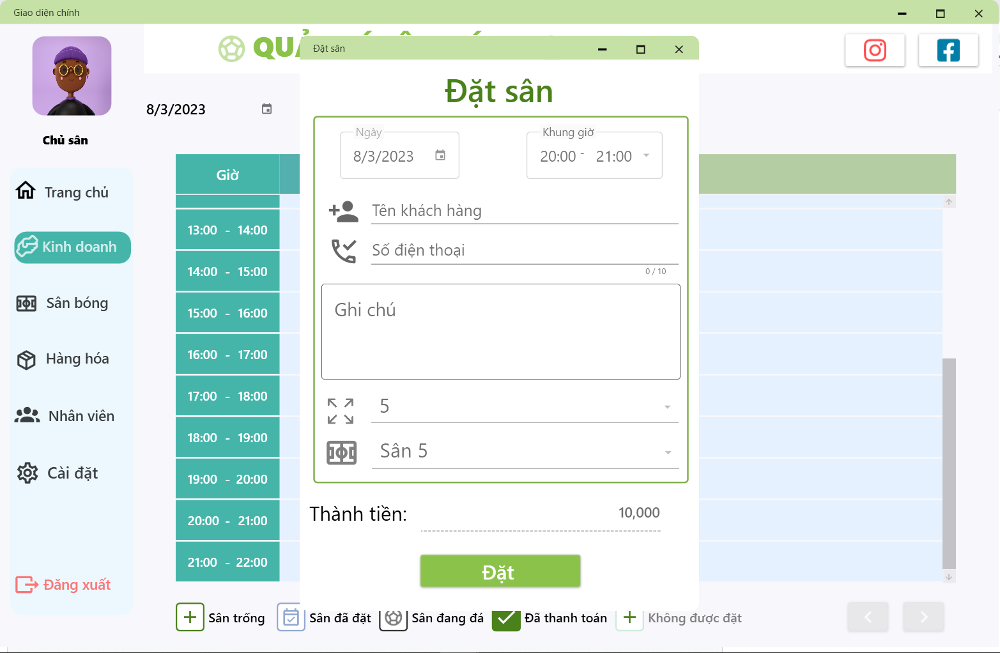
  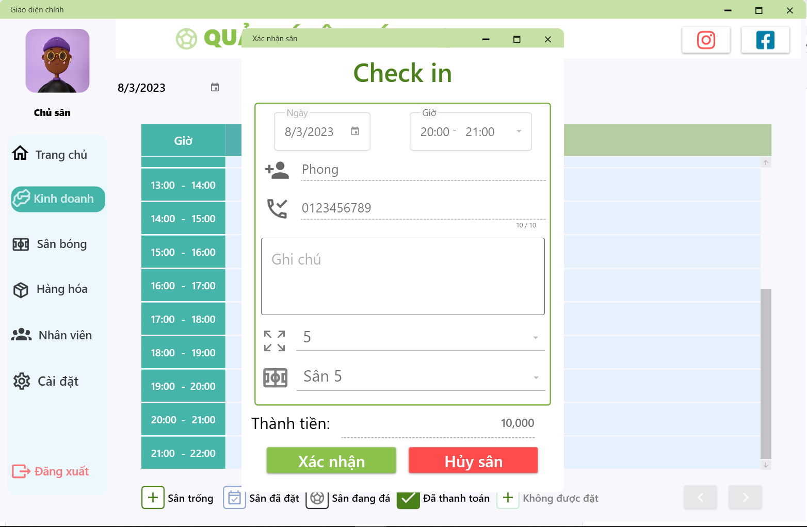
  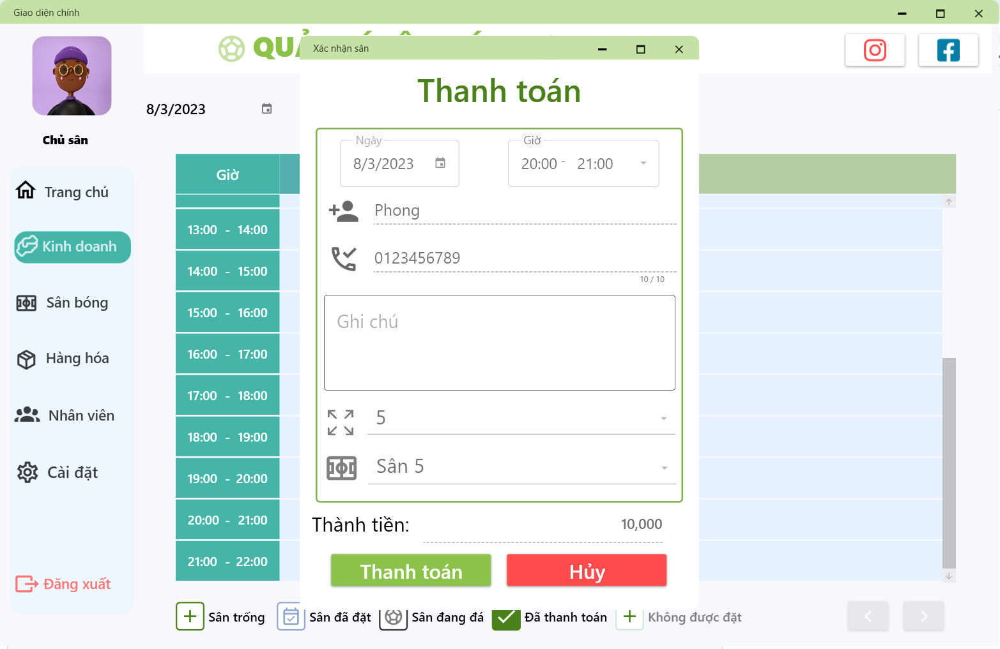
  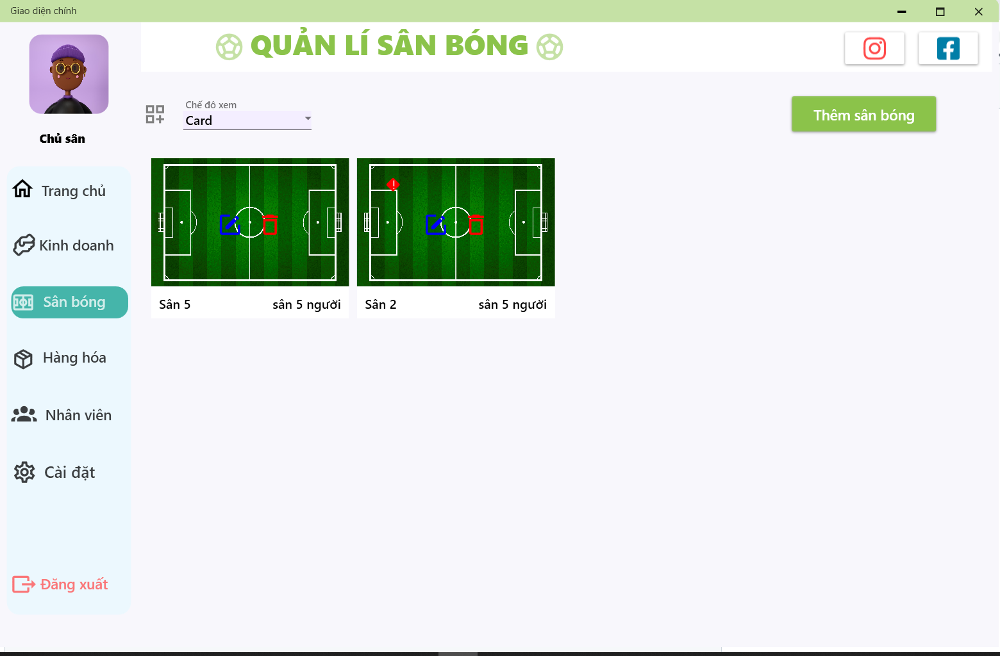
  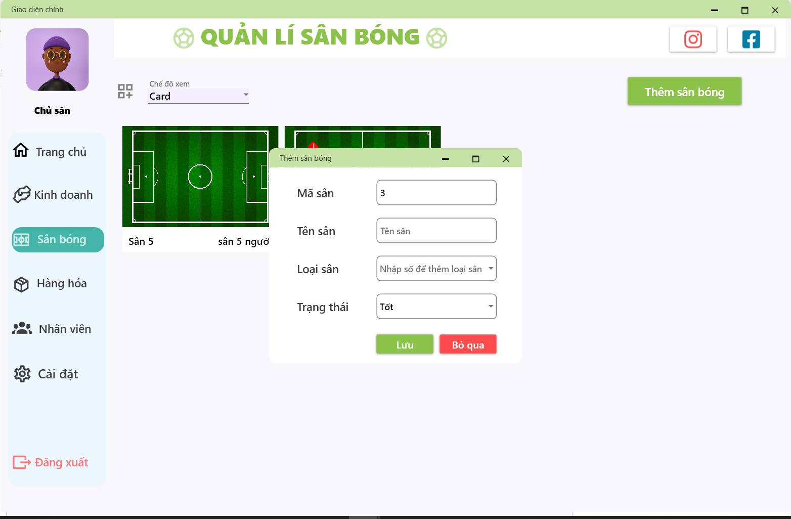
  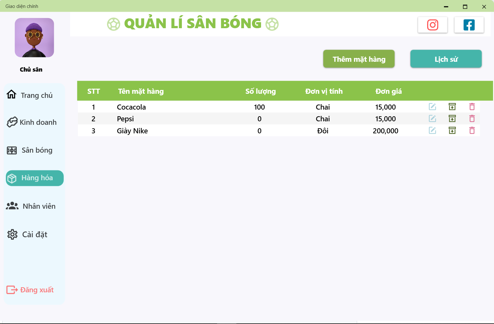
  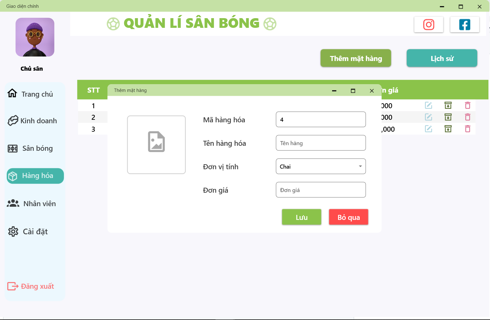
  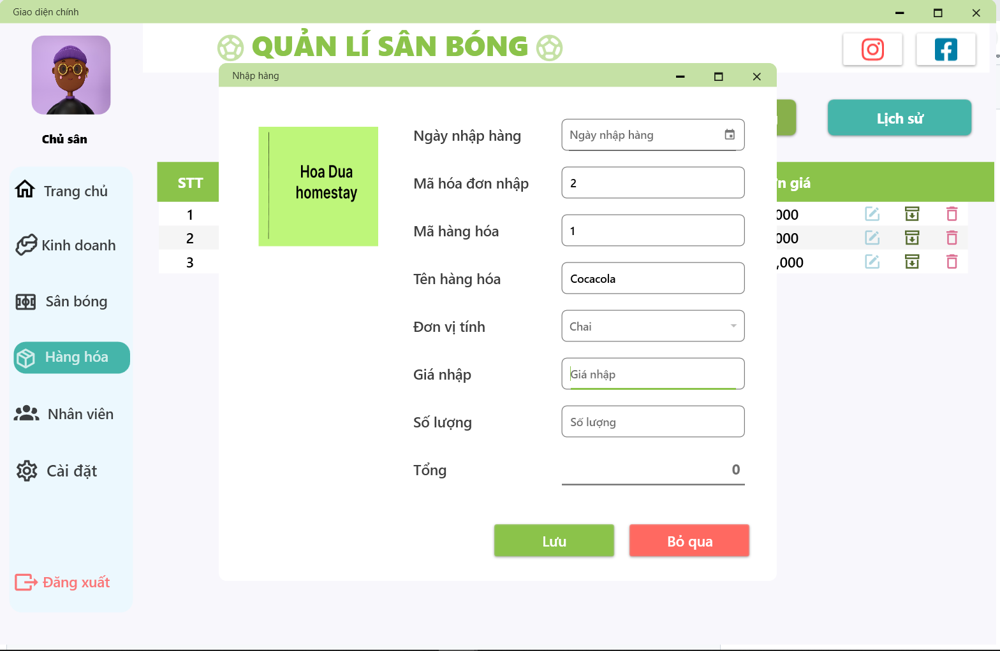
  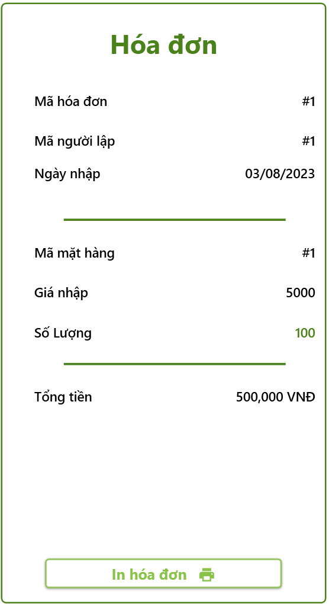
  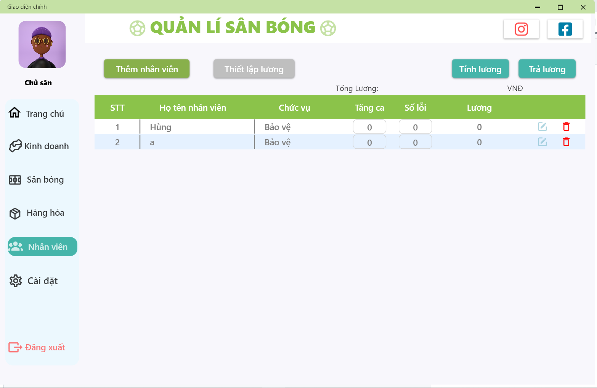
  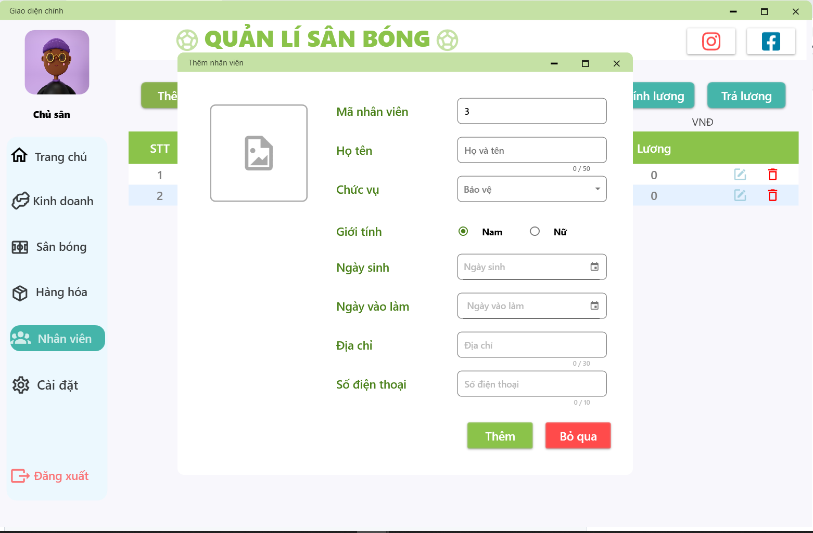

[Lên đầu trang](#top)
### Cài đặt phần mềm 
- Cài đặt MaterialDesign
- Thay đổi tên máy chủ SQL trong App.config
- Cài đặt database [Click vào đây để tải database](https://github.com/pthanhphong1502/Quanlysanbong/blob/main/QlyBongDa.sql)

[Lên đầu trang](#top)
